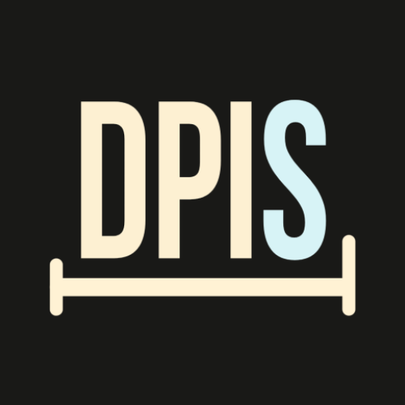

# DPIS



DPIS 是一个基于 LSPosed/Xposed 的 Android 模块，用于按应用独立调整显示参数（虚拟宽度 + 字体大小），在不改全局系统显示设置的前提下，优化单应用观感。

## 核心能力

- 按应用配置虚拟宽度（`dp`）
- 按应用配置字体大小（`50-300%`）
- 宽度与字体均支持 `伪装` / `替换` 两种模式
- 应用列表支持搜索与筛选（全部应用 / 已配置应用）
- 支持系统层 Hook 开关与安全模式

## 环境要求

- Android 8.0+（`minSdk 26`）
- 已 Root 设备
- 已安装并启用 LSPosed/Xposed 环境

## 快速开始

1. 在 LSPosed 中启用 DPIS 模块。
2. 在作用域中勾选目标应用。常规场景不需要勾选 `system`。
3. 打开 DPIS，给目标应用设置：
   - 虚拟宽度（`dp`）
   - 字体大小（`50-300%`）
   - 宽度模式与字体模式（`伪装` / `替换`）
4. 保存后重启目标应用进程生效；必要时重启设备。

## 模式说明

| 模式 | 特点 | 适用场景 | 注意事项 |
| --- | --- | --- | --- |
| `伪装` | 更接近系统原生链路，显示通常更自然 | 追求系统级一致性 | 依赖系统层 Hook；部分应用不支持 |
| `替换` | 直接重写字段，生效更直接 | 大多数常规应用 | 可能出现布局错位或缩放异常 |

## 系统层 Hook 与安全模式

- `关闭`：仅使用目标应用进程内覆写。建议搭配 `替换` 模式。
- `开启`：启用完整 `system_server` 入口，适合调试与对照。
- `开启 + 安全模式`：限制为低风险入口（`activity-start`），推荐作为默认配置。

如果你要使用 `伪装` 模式，请先确保 LSPosed 作用域已勾选 `system`。

## 日志与调试

- `日志输出` 默认建议关闭（降低性能开销）。
- 开启后，`system_server` 高频入口会按采样窗口与去重策略输出。
- 字体调试统计与悬浮窗仅用于诊断，不影响正常生效链路。

## 构建与测试

```powershell
./gradlew :app:assembleDebug
./gradlew :app:testDebugUnitTest
```

可选安装（Windows PowerShell）：

```powershell
./gradlew :app:assembleDebug; if ($LASTEXITCODE -eq 0) { adb install -r "app/build/outputs/apk/debug/app-debug.apk" }
```

## 项目结构

```text
app/                      Android 主模块
  src/main/java/          生产代码
  src/main/res/           资源与界面
  src/test/java/          单元测试
docs/                     当前有效文档
docs/archive/             历史归档文档
refs/                     本地参考资料（LSPosed / AOSP / libxposed）
```

## 文档导航

- 当前文档入口：[docs/README.md](docs/README.md)
- 历史文档归档入口：[docs/archive/README.md](docs/archive/README.md)

## 引用与致谢

DPIS 在实现和演进过程中，参考了以下开源项目的思路与实践，感谢这些项目及其贡献者：

- [libxposed/api](https://github.com/libxposed/api)
- [LSPosed](https://github.com/LSPosed/Lsposed)
- [AdClose](https://github.com/zjyzip/AdClose)
- [App Settings（Xposed-Modules-Repo）](https://github.com/Xposed-Modules-Repo/ru.bluecat.android.xposed.mods.appsettings)
- [InstallerX-Revived](https://github.com/wxxsfxyzm/InstallerX-Revived)
- [InxLocker](https://github.com/Chimioo/inxlocker)
- [视界调节](https://www.coolapk.com/feed/70930481?s=OGJiYmE1YjEyYmQ1MmZnNjllOTNiNWF6a1610b3)

## 免责声明

DPIS 运行于 Root/LSPosed 环境，存在稳定性与兼容性风险。请先备份重要数据，并自行评估使用风险。
